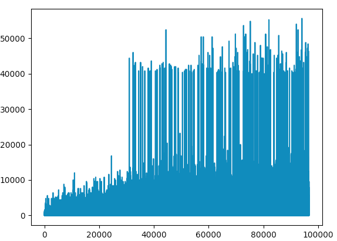

# How it works

## 1.0 Genetic Algorithm

### Seven characteristic values(genes):

- rows_complete
- weighted_height
- cumulative_heights
- relative_height
- holes
- roughness
- fitness

For each piece, we chooce the best position (rotate and offset) by scoring the genes + the next piece's max score can get based on current choice.

For each 10th (or based on population_size value in AIPlayer) update, AI will evolve once.

### How evolve works

We keep the first half, best performance(judged by the game score it geted) genes. We generate another half (of population size) genes by these first half genes. Child gene get random characteristic from parents and with mutation possible.

#### Rules:

* This tetris board has a dimension of 14 * 25
* We measure the algorithm or performance of gene by the score it gets in the game
* If "game over" there will be minus extra score
* Clean multiple lines at once, there will be extra score

### Implementation and Results

The following table show the improvement in score (heighter score better) over first 2600 games:

<table>
  <thead>
    <tr>
      <th>Game</th>
      <th>Score</th>
    </tr>
  </thead>
  <tbody>
    <tr>
      <td>100</td>
      <td>14</td>
    </tr>
  </tbody>
  <tbody>
    <tr>
      <td>500</td>
      <td>21</td>
    </tr>
  </tbody>
  <tbody>
    <tr>
      <td>1000</td>
      <td>21</td>
    </tr>
  </tbody>
  <tbody>
    <tr>
      <td>1500</td>
      <td>24</td>
    </tr>
  </tbody>
  <tbody>
    <tr>
      <td>2000</td>
      <td>8921</td>
    </tr>
  </tbody>
  <tbody>
    <tr>
      <td>2500</td>
      <td>395345</td>
    </tr>
  </tbody>
  <tbody>
    <tr>
      <td>2600</td>
      <td>2655461</td>
    </tr>
  </tbody>
</table>

Untill about 2640 times in the train, using the "game over" to finish training, the tetris AIPlayer works like a "Keep Alive", but it  cab mostly clean one line at the time and have lotts  of holes inside

### Attempted Learning Enhancements

So to improve this, we tried to train it by "holes" in the pieces and learn it the last rule - "Clean multiple lines at once, will get extra score". The piece limit was lowered, to 1000 pieces. The following table show the improvement in score (higher score) over the first 300 games:

<table>
  <thead>
    <tr>
      <th>Game</th>
      <th>Score</th>
    </tr>
  </thead>
  <tbody>
    <tr>
      <td>100</td>
      <td>10</td>
    </tr>
  </tbody>
  <tbody>
    <tr>
      <td>500</td>
      <td>17</td>
    </tr>
  </tbody>
  <tbody>
    <tr>
      <td>1000</td>
      <td>857</td>
    </tr>
  </tbody>
  <tbody>
    <tr>
      <td>1500</td>
      <td>175728</td>
    </tr>
  </tbody>
  <tbody>
    <tr>
      <td>2000</td>
      <td>219327</td>
    </tr>
  </tbody>
  <tbody>
    <tr>
      <td>2500</td>
      <td>554136</td>
    </tr>
  </tbody>
  <tbody>
    <tr>
      <td>3000</td>
      <td>554136</td>
    </tr>
  </tbody>
</table>

In this training way, the AI learned much faster. We can compare the data start from the 1000th game, it seems to abide the clean rule much better, it can clean "2 lines" at once or even "3 lines", and there are fewer holes. The weight of "weighted_height" becomes larger, that means, AI prefers to put pieces on a single column, and the peeks get much higher.

From the 250th train to 300th train, the score never changed, it seems get a "max_score", which is still not good enough from the board result

### TODO

So far there are still many things need to be done to impove this tetris aiplayer

- [ ] Estimate the algorithm, I am not sure which algo "keep alive" or "clean more lines once" is better.
- [ ] Except genetic algorithm, can I use or combine other algorithms to impove the performance
- [ ] Front End

## 2.0 Reinforcement Learning

### Implementation and Results

I did some python version of simplfied tetris using Q learning base on the C++ code from Melax (higher score worse), here is the training result of first 250 times(each time place 10000 random pieces, and the alpha = 0.1, so it learnd quite fast, and it is a tiny board(2 * 6) to make it learn faster)

<table>
  <thead>
    <tr>
      <th>Game</th>
      <th>Score</th>
    </tr>
  </thead>
  <tbody>
    <tr>
      <td>1</td>
      <td>1319</td>
    </tr>
  </tbody>
  <tbody>
    <tr>
      <td>50</td>
      <td>184</td>
    </tr>
  </tbody>
  <tbody>
    <tr>
      <td>100</td>
      <td>183</td>
    </tr>
  </tbody>
  <tbody>
    <tr>
      <td>150</td>
      <td>175</td>
    </tr>
  </tbody>
  <tbody>
    <tr>
      <td>200</td>
      <td>153</td>
    </tr>
  </tbody>
  <tbody>
    <tr>
      <td>250</td>
      <td>185</td>
    </tr>
  </tbody>
</table>

Then use the Q leaning in a real Tetris game, smaller board (6 * 6), here this is the result of the first near 100,000 times training

### Attempted Learning Enhancements2.0
